# Podling Architecture Diagrams

## System Architecture

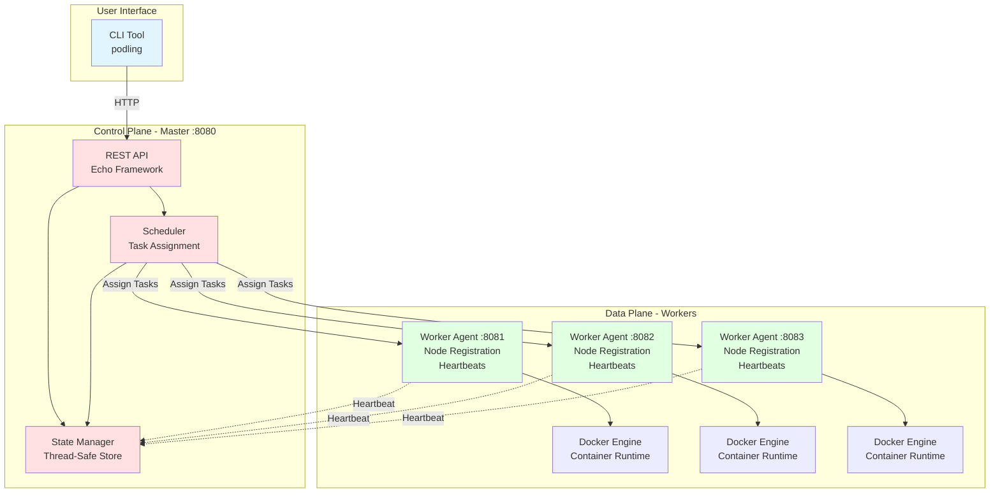

## Task Lifecycle Flow

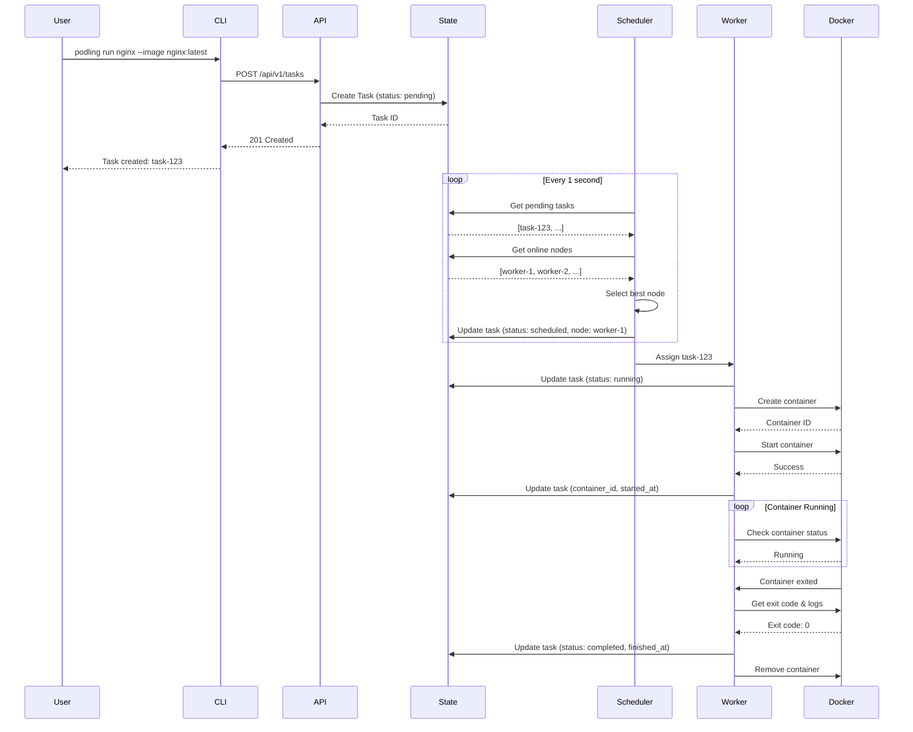

## Worker Heartbeat Mechanism

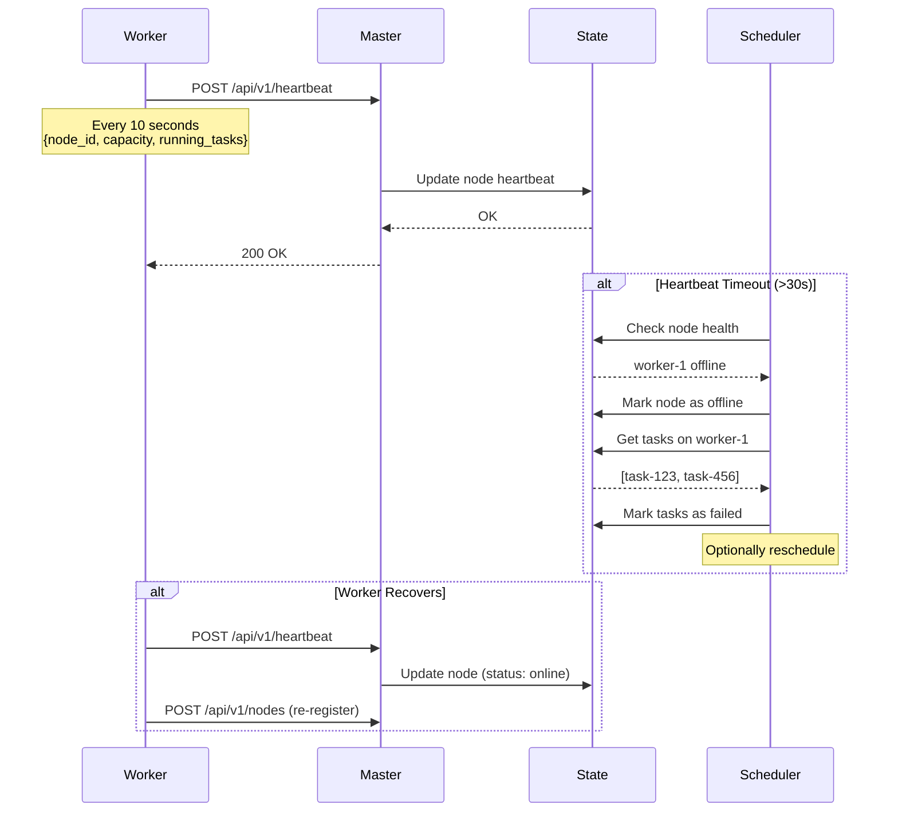

## CLI Command Flow

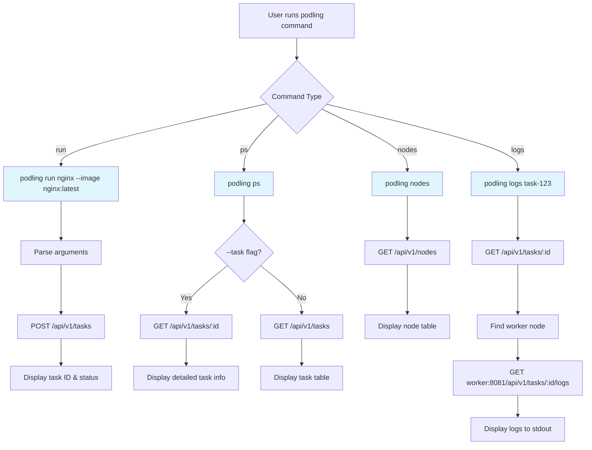

## State Management

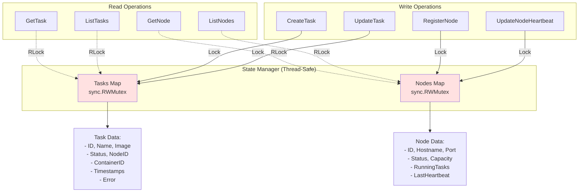

## Scheduling Algorithm

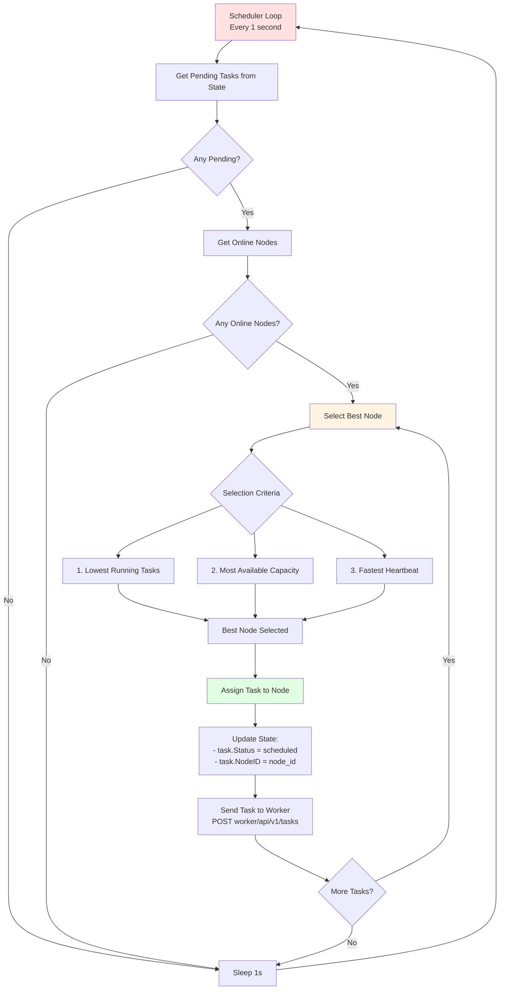

## Data Models

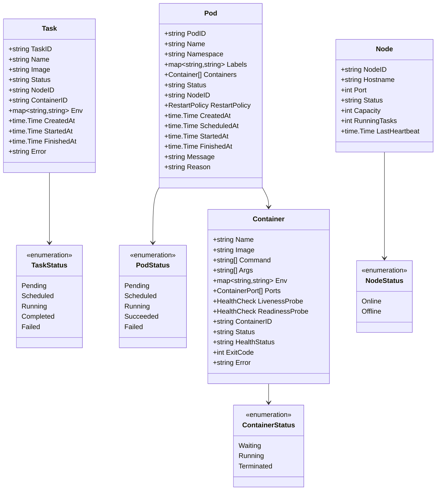

## API Endpoints

```mermaid
graph LR
    subgraph "Master API :8080"
        direction TB
        T[Tasks]
        T1[POST /api/v1/tasks<br/>Create Task]
        T2[GET /api/v1/tasks<br/>List Tasks]
        T3[GET /api/v1/tasks/:id<br/>Get Task]

        P[Pods]
        P1[POST /api/v1/pods<br/>Create Pod]
        P2[GET /api/v1/pods<br/>List Pods]
        P3[GET /api/v1/pods/:id<br/>Get Pod]
        P4[PUT /api/v1/pods/:id/status<br/>Update Pod Status]
        P5[DELETE /api/v1/pods/:id<br/>Delete Pod]

        N[Nodes]
        N1[POST /api/v1/nodes<br/>Register Node]
        N2[GET /api/v1/nodes<br/>List Nodes]
        N3[POST /api/v1/heartbeat<br/>Node Heartbeat]
    end

    subgraph "Worker API :8081+"
        direction TB
        W[Worker Operations]
        W1[POST /api/v1/tasks<br/>Assign Task]
        W2[GET /api/v1/tasks/:id<br/>Get Task Status]
        W3[GET /api/v1/tasks/:id/logs<br/>Get Container Logs]
    end

    style T1 fill:#e1f5ff
    style T2 fill:#e1f5ff
    style T3 fill:#e1f5ff
    style P1 fill:#d4edff
    style P2 fill:#d4edff
    style P3 fill:#d4edff
    style P4 fill:#d4edff
    style P5 fill:#d4edff
    style N1 fill:#ffe1e1
    style N2 fill:#ffe1e1
    style N3 fill:#ffe1e1
    style W1 fill:#e1ffe1
    style W2 fill:#e1ffe1
    style W3 fill:#e1ffe1
```

## Pod Lifecycle Flow

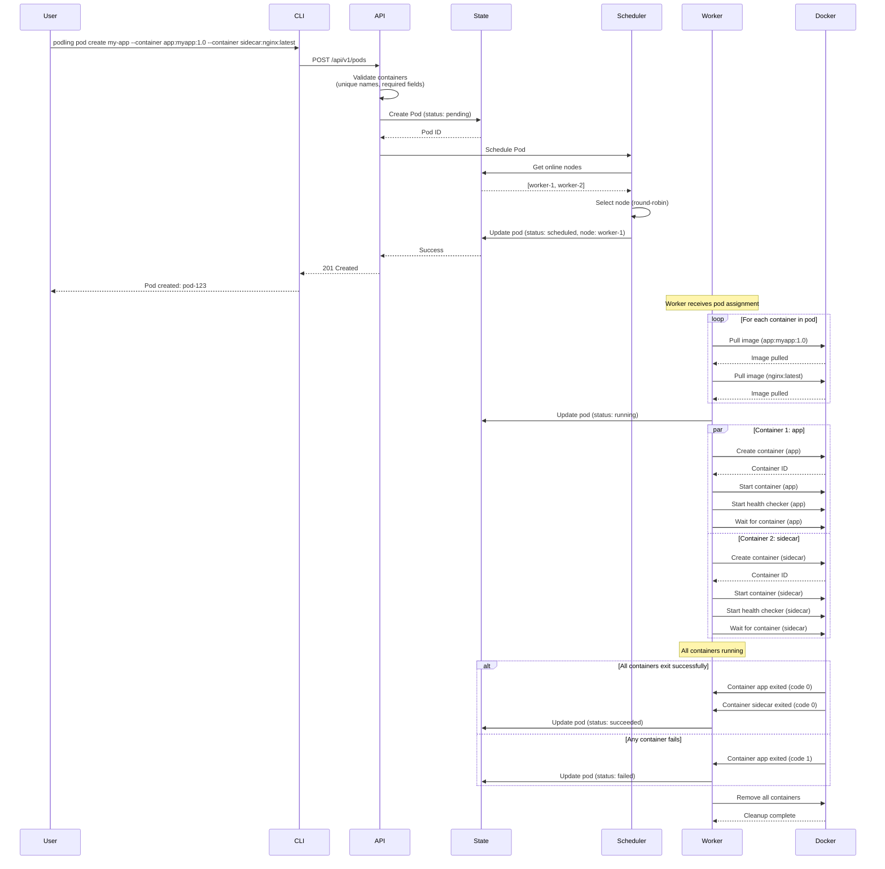

## Error Handling & Recovery

### Task State Diagram

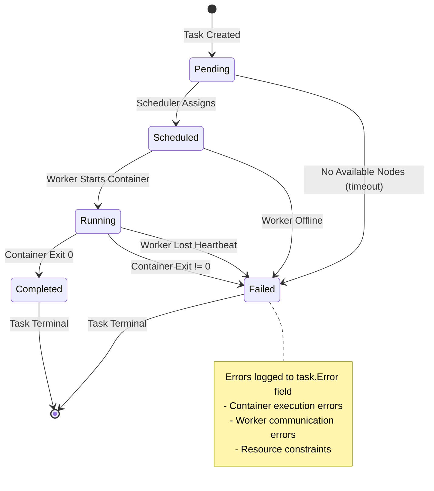

### Pod State Diagram

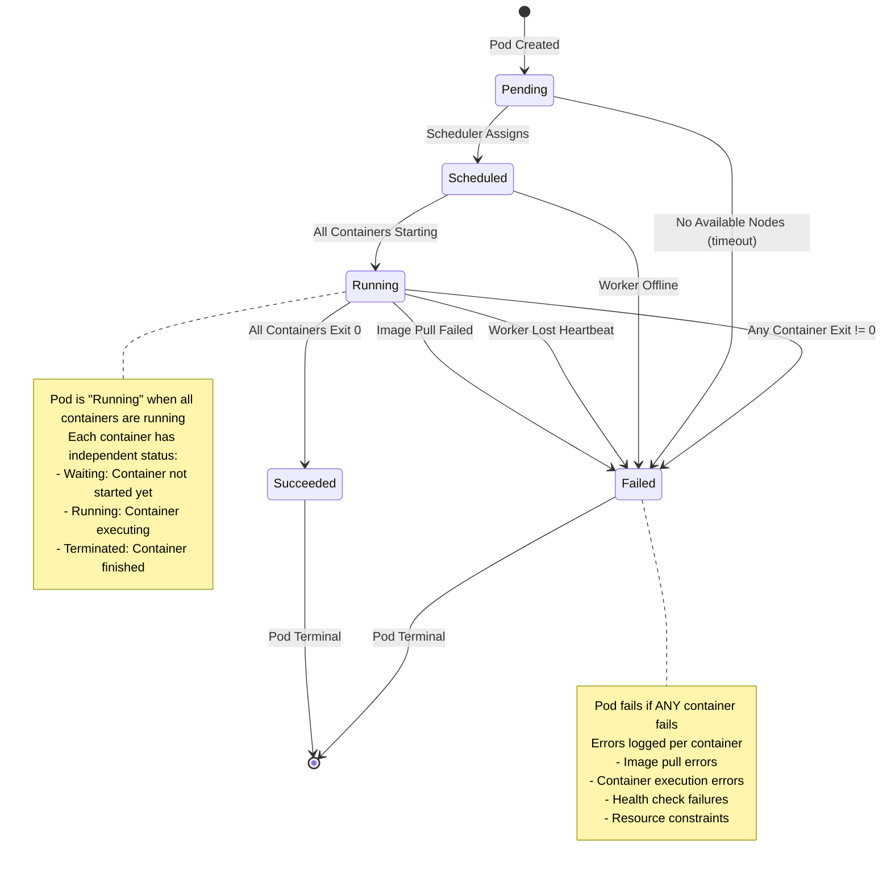

## Deployment Topology

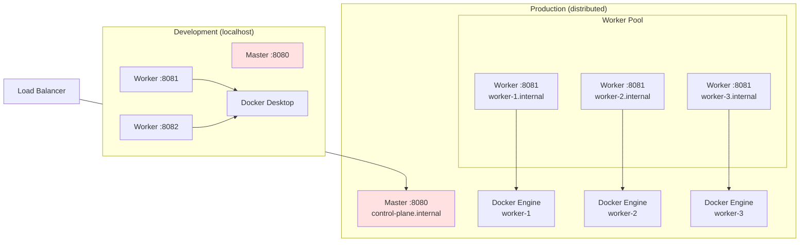
